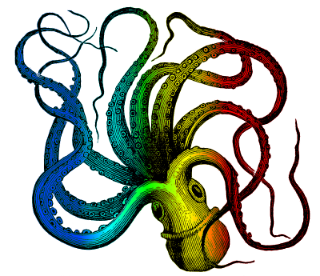

<h1>erdos.fun</h1>

A Clojure library of some common utility functions for a better workflow.

Currently includes:

 - `erdos.fun`: some functional programming helpers
 - `erdos.fun.docs`: generates documentation from source code
 - `erdos.fun.walk`: helps analyzing clj source code

## Documentation

Read the [erdos.fun documentation](doc/index.md) generated from the source code.

## License

Copyright © 2016 FIXME

Distributed under the Eclipse Public License either version 1.0 or (at
your option) any later version.
